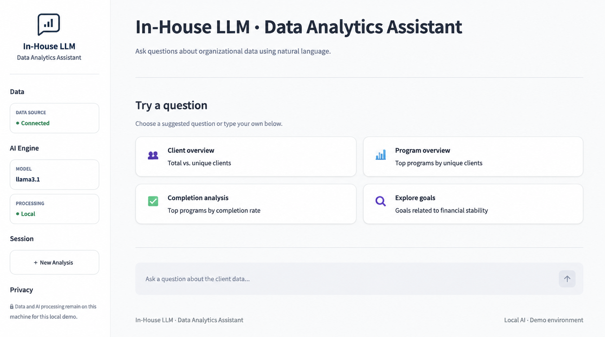
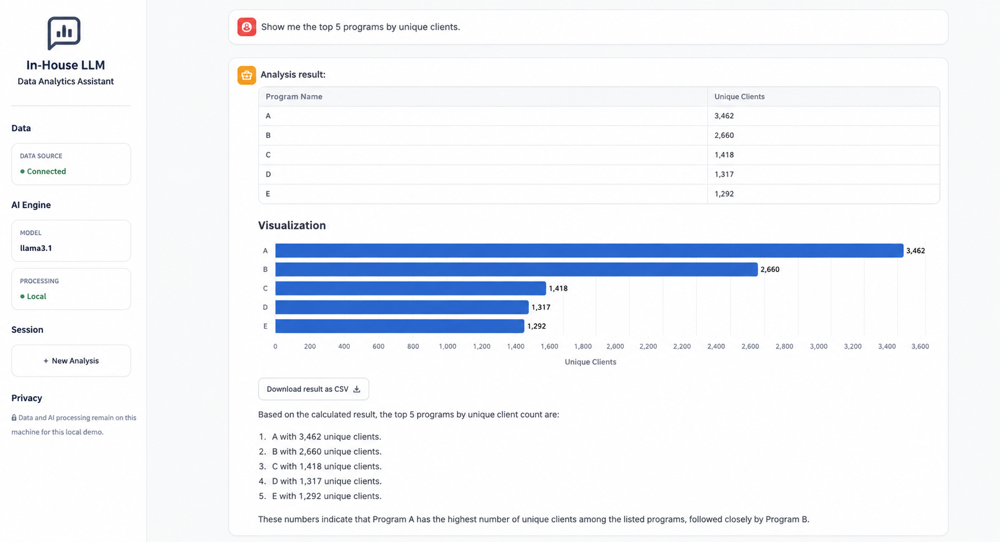
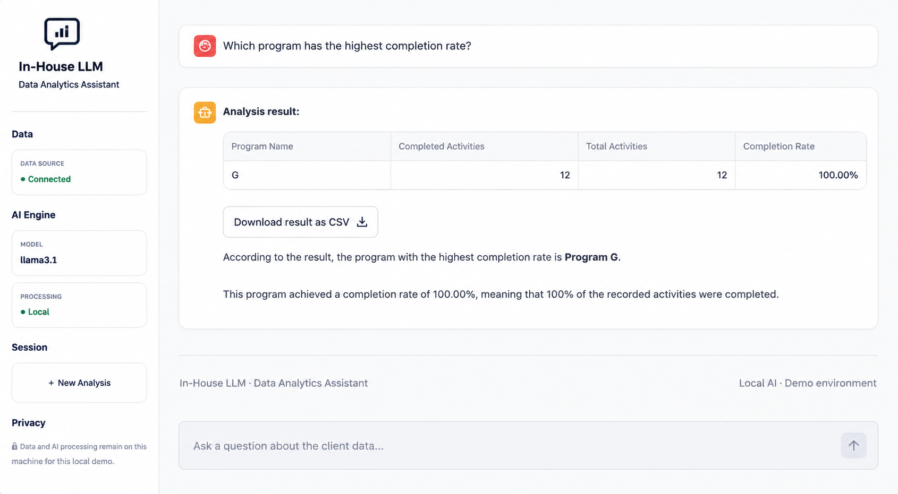
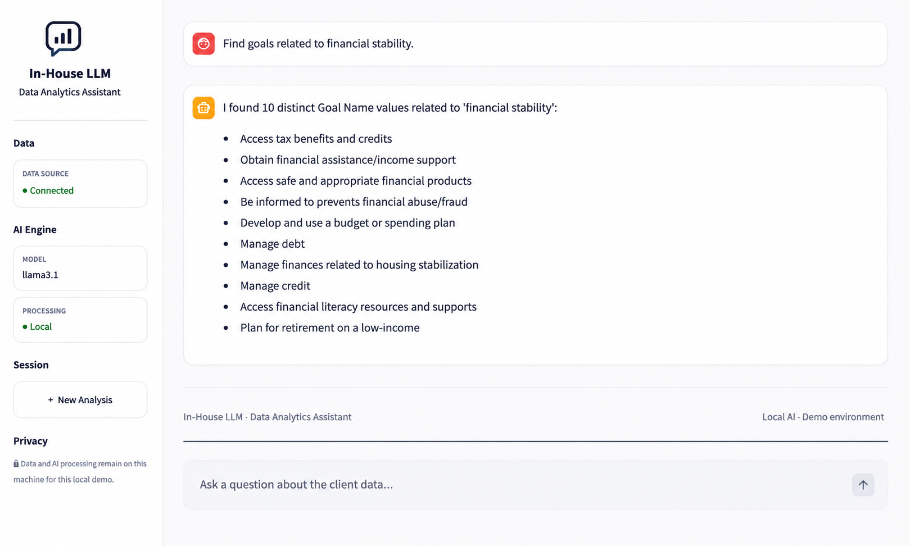
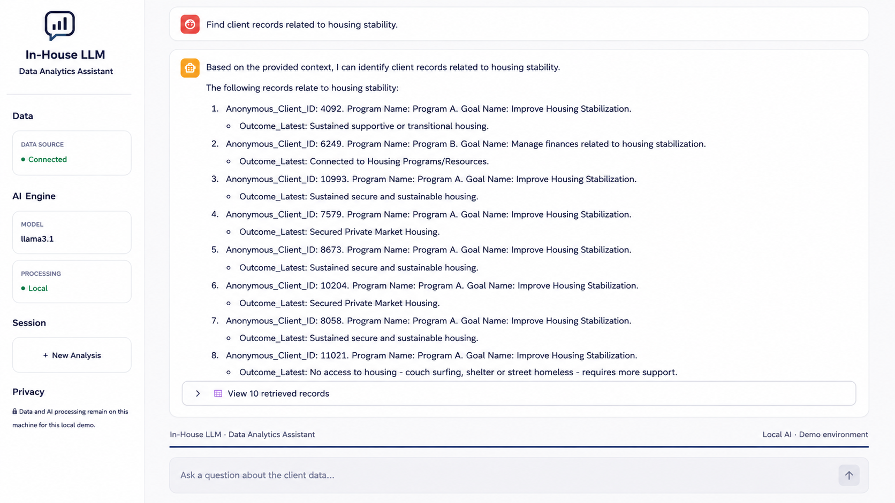
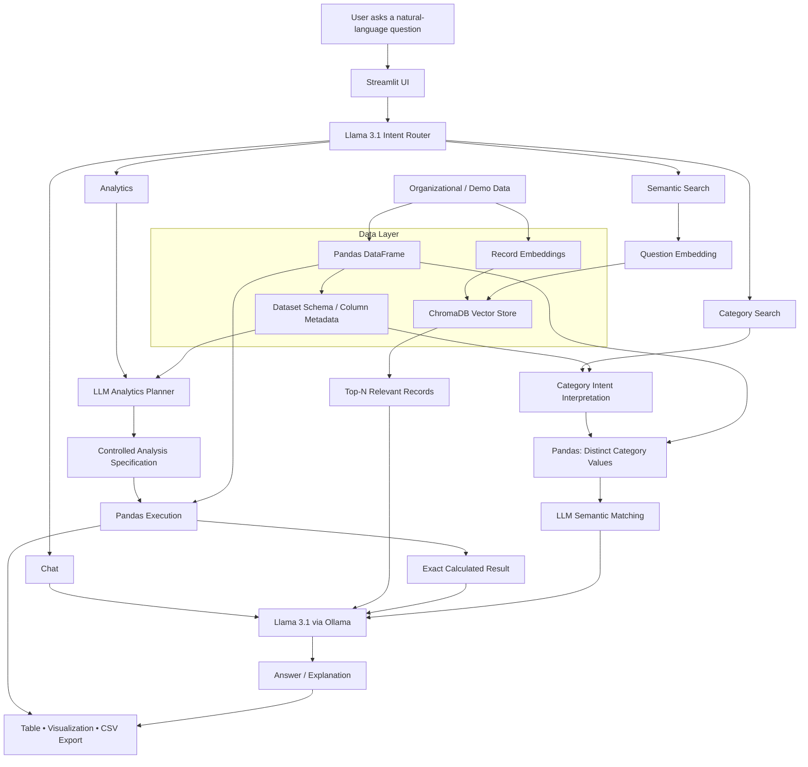

# In-House LLM Data Analytics Assistant

A local, privacy-focused AI analytics prototype that combines **Llama 3.1**, **Ollama**, **Python**, **Pandas**, **ChromaDB**, **vector embeddings**, **Altair**, and **Streamlit** to enable natural-language exploration of structured data.

The system follows a core engineering principle: **use the LLM for language understanding, intent interpretation, semantic reasoning, and explanation—while deterministic analytical tools perform authoritative calculations.**

> **Repository type:** Technical showcase / portfolio project  
> **Project status:** Active prototype

> **Source code notice:** This public repository documents the architecture, capabilities, engineering decisions, and demonstrated behavior of the project. The complete application source code, prompts, orchestration logic, analytical execution engine, and implementation-specific components are intentionally not published.

---

## Application demo

The screenshots below show the working prototype using generic branding and anonymized demonstration content. They are intended to demonstrate product behavior and system capabilities without exposing organizational data or implementation-specific source code.

### 1. Natural-language analytics interface

The Streamlit interface provides a conversational entry point for analytical questions and exposes the local model/runtime status, session controls, and suggested analytical workflows.



### 2. Deterministic grouped analytics

A natural-language request for the top programs by unique clients is interpreted by the LLM, while the aggregation and ranking are executed deterministically against the structured dataset. The result is presented as a table, visualization, downloadable output, and evidence-grounded explanation.



### 3. Calculated business metric

The prototype can interpret a higher-level analytical question, execute the underlying metric calculation deterministically, rank the result, and provide a concise natural-language explanation. Program labels shown in the public demo are anonymized.



### 4. Semantic category discovery

Category-search requests follow a different path from numerical analytics. Candidate categorical values are obtained deterministically from the structured data and semantic reasoning is then used to identify values related to the user's concept.



### 5. Semantic record retrieval

For meaning-based record discovery, the user's question is represented as an embedding and compared against record-level vectors in ChromaDB. The most relevant records are retrieved and supplied as controlled context for the response rather than passing the complete dataset to the LLM.



---

## Project objective

Traditional BI tools are effective for predefined dashboards and metrics, but business users frequently need to explore data through ad-hoc questions that were not anticipated when a dashboard was designed.

This project explores a hybrid analytical architecture in which a locally hosted LLM acts as a natural-language intelligence layer over deterministic analytics and semantic retrieval capabilities.

The prototype was developed and tested against a **synthetic structured dataset containing 30,000 client records**, allowing the concept to be demonstrated without exposing confidential or production data.

---

## Core capabilities

### 1. Conversational interaction

Handles general conversational requests such as greetings, assistant identity, and capability questions.

### 2. Deterministic analytics

Natural-language analytical questions are interpreted by the LLM and translated into a controlled analytical plan. The actual computation is performed against the full structured dataset using Pandas rather than relying on the LLM to calculate metrics directly.

Demonstrated analytical patterns include:

- Total and distinct counts
- Grouped aggregations
- Average, minimum, and maximum calculations
- Top / bottom N ranking
- Conditional filtering
- Conditional metrics
- Percentages and ratios
- Calculated metrics such as completion rates
- Business-rule normalization for critical metric definitions

### 3. Semantic search

The system supports meaning-based retrieval of relevant records using **vector embeddings + ChromaDB**, rather than relying exclusively on exact keyword matching.

Example:

> `Find client records related to housing stability.`

### 4. Category search

For categorical exploration, the system can extract distinct values from structured data and use semantic reasoning to identify categories related to the user's concept.

Example:

> `Find goals related to finding employment.`

### 5. Automated analytical presentation

Depending on the question and route, results can be presented as:

- Interactive tables
- Dynamically generated visualizations
- Natural-language analytical explanations
- Retrieved semantic records
- Matched categorical values
- CSV exports
- Persistent results within the active analysis session

---

## High-level architecture

The architecture deliberately separates the **data layer**, **deterministic computation layer**, and **LLM intelligence layer**.

The complete structured dataset is maintained in a Pandas DataFrame for deterministic analytics. A separate vectorized representation of record-level content is stored in ChromaDB for semantic retrieval.

**The complete source dataset is not passed directly to Llama 3.1.** The model receives controlled context appropriate to the selected workflow—for example, schema information for analytical planning, retrieved records for semantic reasoning, candidate category values for matching, or calculated results for explanation.



### Data-access principle

```text
Source / Demo Data
      │
      ├──> Pandas DataFrame ──> deterministic analytics
      │
      └──> embeddings ──> ChromaDB ──> semantic retrieval

The full source dataset is not passed directly to Llama 3.1.
```

The LLM interacts with controlled representations of the data depending on the route:

- **Analytics:** dataset schema/column metadata supports intent planning; deterministic tools execute the calculation; calculated results can then be supplied to the LLM for explanation.
- **Semantic Search:** the user's question is embedded and compared with vectors in ChromaDB; only the most relevant retrieved records are exposed downstream.
- **Category Search:** deterministic processing extracts candidate categorical values and the LLM performs semantic matching over those candidates.
- **Chat:** general conversational interaction does not require access to the analytical dataset.

---

## Hybrid LLM + deterministic analytics design

A central design decision was **not to treat the LLM as the calculation engine**.

LLMs are effective at interpreting natural language and analytical intent, but authoritative aggregation over thousands of records is better handled by deterministic analytical software.

Conceptually, the analytics workflow is:

```text
Natural-language question
        ↓
LLM interprets analytical intent
        ↓
Controlled analytical specification
        ↓
Validation / business-rule layer
        ↓
Pandas executes against the full dataset
        ↓
Exact calculated result
        ↓
LLM generates a human-readable explanation
```

This separation provides the flexibility of conversational analytics while reducing dependence on probabilistic numerical reasoning.

> The public repository intentionally documents this workflow at the architectural level rather than publishing the complete planner prompts, validation rules, execution logic, or orchestration implementation.

---

## Semantic retrieval / RAG concept

The semantic-search path uses record-level vector retrieval.

### Indexing concept

```text
Structured records
      ↓
Text representation
      ↓
Embedding model
      ↓
Record vectors
      ↓
ChromaDB
```

### Query concept

```text
User question
      ↓
Question embedding
      ↓
ChromaDB similarity search
      ↓
Top-N relevant records
      ↓
Augmented prompt / controlled context
      ↓
Llama 3.1
      ↓
Natural-language response
```

In RAG terms, ChromaDB performs the **retrieval** step by finding records whose embeddings are semantically closest to the query embedding. Those retrieved records augment the model context, and Llama generates a response grounded in that retrieved evidence.

The complete vector store and source dataset are not supplied to the LLM for each semantic query.

---

## Example questions demonstrated

### Chat

```text
Hello!
What's your name?
Tell me all the different ways you can help me.
```

### Analytics

```text
What are the total and unique numbers of clients?
How many unique clients are in each program?
Show me the top 5 programs by unique clients.
Show me the bottom 5 programs by unique clients.
What is the average age of clients by program?
Which program has the highest completion rate?
What percentage of unique clients achieved their goals?
What percentage of client records have GSP Status = Completed?
```

### Semantic Search

```text
Find client records related to housing stability.
Find client records related to financial stability.
```

### Category Search

```text
Find goals related to finding employment.
Find goals related to financial stability.
Find programs related to employment.
```

---

## Technology stack

| Layer | Technology | Role in the prototype |
|---|---|---|
| Local LLM | **Llama 3.1** | Natural-language understanding, intent routing, analytical planning, semantic reasoning, explanations |
| Local model runtime | **Ollama** | Local model execution |
| Analytics engine | **Pandas** | Deterministic filtering, aggregation, grouping, and metric calculation |
| Vector database | **ChromaDB** | Vector storage and similarity retrieval |
| Embeddings | **Sentence Transformers** | Vector representation of searchable text |
| Application layer | **Streamlit** | Interactive natural-language analytics interface |
| Visualization | **Altair** | Dynamic analytical visualizations |
| Core language | **Python** | Application orchestration and analytical integration |

---

## Reliability and analytical safeguards

The prototype incorporates controls intended to make LLM-assisted analytics more dependable. At a high level, these include:

- Constraining analytical operations to supported patterns
- Grounding analytical planning in the available dataset schema
- Separating probabilistic intent interpretation from deterministic execution
- Applying explicit business rules to critical metric definitions
- Distinguishing total-record calculations from distinct-entity calculations
- Validating analytical requests before execution
- Calculating derived metrics from deterministic intermediate results
- Restricting explanations to calculated or retrieved evidence
- Handling ranking, sorting, and tied results explicitly
- Avoiding unsupported conclusions about service effectiveness from descriptive metrics alone

Detailed prompts, validation logic, normalization rules, and execution code are intentionally retained in the private implementation.

---

## Local-first processing

The current prototype runs Llama 3.1 locally through Ollama rather than calling an externally hosted LLM for each inference request.

```text
Application
    ↓
Local Ollama runtime
    ↓
Llama 3.1
```

This architecture demonstrates how an organization can explore LLM-assisted analytics while maintaining greater control over the inference environment.

> Local execution alone does not constitute a complete enterprise security, privacy, governance, or deployment framework. Those concerns require additional controls in a production implementation.

---

## Demonstrated workflow

At a high level, the prototype:

1. Prepares structured demo data for deterministic analysis.
2. Creates a separate vector representation for semantic retrieval.
3. Accepts natural-language questions through an interactive UI.
4. Uses an LLM-based intent layer to identify the appropriate analytical path.
5. Routes requests across conversational, deterministic analytics, semantic-search, and category-search workflows.
6. Uses controlled context rather than passing the complete source dataset directly to the LLM.
7. Executes numerical calculations through deterministic analytical tooling.
8. Produces user-facing tables, visualizations, explanations, semantic results, and downloadable analytical outputs.

Implementation-specific prompts, functions, routing rules, validation logic, and source code are intentionally omitted from this public showcase.

---

## Engineering challenges addressed

The prototype was designed around several practical problems that arise when applying LLMs to structured analytics:

**LLM numerical reliability**  
Separating natural-language interpretation from authoritative numerical execution.

**Analytical ambiguity**  
Distinguishing concepts such as total records versus unique entities and applying deterministic business definitions before execution.

**Semantic vs. analytical questions**  
Routing meaning-based retrieval separately from aggregation and metric calculations.

**Dynamic result presentation**  
Generating an appropriate table, visualization, explanation, or downloadable result based on the analytical output.

**Data exposure control**  
Avoiding unnecessary transmission of the complete structured dataset into the model context.

---

## Planned enhancements

Areas being explored for future iterations include:

- Dynamic CSV / Excel ingestion
- Automatic semantic indexing of newly supplied datasets
- Multi-dataset metadata and routing
- More advanced categorical normalization and semantic matching
- Document-oriented RAG for PDF / Word content
- Vision-capable analysis for images and charts
- Expanded diagnostic and statistical analytics
- Automated validation and regression testing for analytical plans
- More modular service-oriented application architecture
- Authentication, authorization, audit logging, and enterprise governance controls

---

## Public repository scope

This repository is intentionally maintained as a **technical portfolio showcase rather than a reproducible open-source distribution**.

Public materials may include architecture documentation, technical design explanations, technology choices, feature demonstrations, selected screenshots, example questions/outputs, and high-level conceptual workflows.

The complete application source code, production or organizational datasets, complete synthetic development datasets, vector database contents, detailed LLM prompts, analytical execution/normalization logic, internal configuration, credentials, and secrets are intentionally excluded.

The goal is to demonstrate **system-design capability, AI/analytics engineering decisions, and working product behavior without publishing a step-by-step implementation that reproduces the complete application.**

---

## Source code availability

The complete implementation is maintained privately.

This public repository documents the project's architecture and demonstrated capabilities for professional portfolio and technical discussion purposes. Selected implementation excerpts may be shared separately when appropriate, but the repository is intentionally not designed as an installation or reproduction guide.

---

## Author

**Ishtiaque Ahmed**  
Business Intelligence & Analytics Engineer | Data Engineering | AI-Powered Analytics

GitHub: [@ahmed-ishtiaque](https://github.com/ahmed-ishtiaque)

---

## Disclaimer

This project is an independently developed technical prototype for learning, demonstration, and portfolio purposes. Public materials use generic **In-House LLM** terminology and are intended to avoid exposing confidential organizational information or proprietary implementation details.
