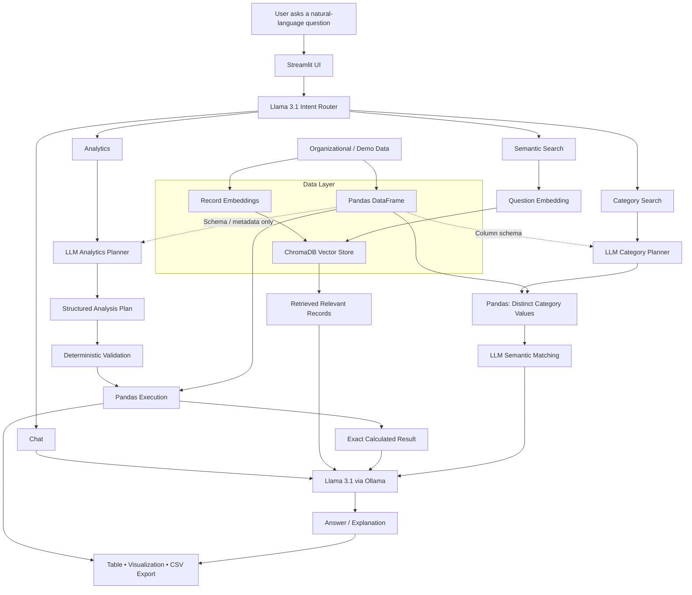

# In-House LLM Data Analytics Assistant

A local, privacy-focused AI analytics application that combines **Llama 3.1**, **Ollama**, **Python**, **Pandas**, **ChromaDB**, **vector embeddings**, **Altair**, and **Streamlit** to let users explore structured data using natural language.

The project is designed around a simple principle: **use the LLM for language understanding and reasoning, but use deterministic analytics tools for the calculations themselves.**

> **Project status:** Active prototype / portfolio project

---

## Why this project

Traditional BI tools are excellent for predefined dashboards and metrics, but business users often want to ask ad-hoc questions in natural language. This project explores how a locally hosted LLM can sit on top of an analytical data layer and make that experience more conversational without relying on an external LLM API for every query.

The current demo uses a **synthetic dataset with 30,000 client records** so the project can be shared publicly without exposing confidential or production data.

---

## Core capabilities

### 1. Conversational Chat
General interaction with the assistant, including greetings, identity, capabilities, and other non-analytical questions.

### 2. Deterministic Analytics
Natural-language analytical questions are translated into a structured analysis plan and executed against the full dataset with Pandas.

Supported analytical patterns include:

- Total counts and distinct counts
- Grouped aggregations
- Averages, medians, minimums, and maximums
- Top / bottom N ranking
- Multi-condition filtering
- Conditional metrics
- Percentages and ratios
- Calculated metrics such as completion rates
- Business-rule validation for critical metric definitions

### 3. Semantic Search
Individual records can be retrieved by **meaning rather than exact keyword matching** using vector embeddings and ChromaDB.

Example:

> `Find client records related to housing stability.`

### 4. Category Search
The application can inspect distinct categorical values and use the LLM to identify values semantically related to a concept.

Example:

> `Find goals related to finding employment.`

### 5. Automated Result Presentation
Analytical results can automatically produce:

- Interactive tables
- Horizontal bar charts
- Natural-language explanations
- CSV exports
- Persistent conversation history within the active session

---

## Architecture

The architecture deliberately separates the **data layer** from the **LLM layer**. The complete structured dataset is loaded into Pandas for deterministic analytics, while a vectorized representation is stored in ChromaDB for semantic retrieval. The LLM does not receive the entire source dataset directly; it receives only the schema/metadata needed for planning, retrieved context when performing semantic search, or calculated results when generating explanations.



### Data-access principle

```text
Source / Demo Data
      │
      ├──> Pandas DataFrame ──> deterministic analytics
      │
      └──> embeddings ──> ChromaDB ──> semantic retrieval

The full source dataset is not passed directly to Llama 3.1.
```

The LLM interacts with controlled representations of the data depending on the route:

- **Analytics:** dataset schema/metadata → LLM planner; structured plan → Pandas; calculated result → LLM explanation.
- **Semantic Search:** question embedding → ChromaDB; retrieved relevant records → LLM explanation.
- **Category Search:** Pandas extracts distinct values; the LLM performs semantic matching over those candidate category values.
- **Chat:** no dataset access is required for general conversational questions.

---

## Why the LLM does not perform the calculations directly

LLMs are strong at interpreting language, understanding analytical intent, and explaining results, but they are probabilistic systems. Large-scale aggregation should therefore not depend on the model "mentally" calculating over thousands of rows.

For analytical questions, this project separates responsibilities:

```text
Natural-language question
        ↓
Llama 3.1 interprets analytical intent
        ↓
Structured analysis plan
        ↓
Deterministic validation / business rules
        ↓
Pandas executes the calculation
        ↓
Llama 3.1 explains the calculated result
```

This design reduces the risk of hallucinated numerical results while preserving the flexibility of natural-language interaction.

---

## Example questions

### Chat

```text
Hello!
What's your name?
Tell me all the different ways you can help me.
```

### Analytics

```text
What are the total and unique numbers of clients?
How many unique clients are in each program?
Show me the top 5 programs by unique clients.
Show me the bottom 5 programs by unique clients.
What is the average age of client by program?
Which program has the highest completion rate?
What percentage of unique clients achieved their goals?
What percentage of client records have GSP Status = Completed?
How many total client records in Family Newcomer Services have GSP Status = Completed?
```

### Semantic Search

```text
Find client records related to housing stability.
Find client records related to financial stability.
```

### Category Search

```text
Find goals related to finding employment.
Find goals related to financial stability.
Find programs related to employment.
```

---

## Technology stack

| Layer | Technology | Role |
|---|---|---|
| Local LLM | **Llama 3.1** | Natural-language understanding, routing, planning, explanations |
| Local model runtime | **Ollama** | Runs Llama locally and exposes a localhost API |
| Analytics engine | **Pandas** | Deterministic filtering, aggregation, grouping, metrics |
| Vector database | **ChromaDB** | Stores and retrieves embedded records |
| Embeddings | **Sentence Transformers** | Converts text into vector representations |
| Application | **Streamlit** | Interactive user interface and session experience |
| Visualization | **Altair** | Automatically generated analytical charts |
| Language | **Python** | Application, orchestration, analytics, and integration logic |

---

## Analytical design

The analytics route uses an LLM-generated structured plan rather than asking the model to generate arbitrary Python code.

A simplified plan for:

> `Show me the top 5 programs by completion rate.`

looks conceptually like:

```json
{
  "group_by": ["Program Name"],
  "metrics": [
    {
      "column": "Completed Activities",
      "aggregation": "sum",
      "alias": "Completed Activities"
    },
    {
      "column": "Total Activities",
      "aggregation": "sum",
      "alias": "Total Activities"
    }
  ],
  "calculated_metrics": [
    {
      "name": "Completion Rate",
      "operation": "divide",
      "numerator": "Completed Activities",
      "denominator": "Total Activities",
      "multiply_by": 100
    }
  ],
  "sort_by": "Completion Rate",
  "sort_order": "descending",
  "limit": 5
}
```

Pandas executes the plan against the dataset and returns the exact result. The LLM receives the calculated output only for explanation.

---

## Reliability safeguards implemented

The prototype includes several controls designed to make LLM-assisted analytics more reliable:

- Allowed analytical operations are explicitly constrained.
- The planner can only use columns from the discovered dataset schema.
- Critical client-count definitions are normalized before execution.
- Distinct-client calculations use a designated client identifier.
- Calculated metrics operate on previously computed metric aliases.
- Conditional metrics are separated from global metrics.
- Filters are normalized and validated before execution.
- The explanation layer is instructed to use only the calculated result.
- Explanations avoid unsupported claims about program effectiveness or service quality.
- Tied highest / lowest results are preserved in explanations.

---

## Local-first processing

The current prototype runs the LLM locally through Ollama.

```text
Streamlit application
       ↓
http://localhost:11434
       ↓
Ollama
       ↓
Llama 3.1
```

This means the application does not require an external hosted LLM API for inference in the current local-demo configuration.

> This repository is a technical prototype and does not represent a production security, privacy, governance, or deployment certification.

---

## Current demo workflow

1. Load the structured demo dataset into Pandas for deterministic analytics.
2. Build an automatic schema description from the DataFrame for analytical planning.
3. Independently pre-index record text as embeddings in ChromaDB for semantic retrieval.
4. Accept a natural-language question through Streamlit.
5. Route the question to Chat, Analytics, Semantic Search, or Category Search.
6. Execute the appropriate workflow without passing the complete source dataset directly to the LLM.
7. Provide the LLM only the controlled context required by the selected route, such as schema metadata, retrieved records, distinct category candidates, or calculated results.
8. Return a table, visualization, explanation, retrieved context, or categorical result.
9. Allow analytical tables to be exported to CSV.

---

## Planned enhancements

The prototype is intentionally iterative. Future enhancements include:

- Dynamic CSV / Excel upload
- Automatic indexing of newly uploaded datasets
- Multi-dataset selection and metadata management
- Smarter categorical-value normalization and synonym matching
- PDF / Word document ingestion and RAG
- Image / chart analysis using a vision-capable local model
- More advanced diagnostic and statistical analysis
- Test suite for analytical-plan validation
- Modularization of the current application into production-oriented services
- Authentication, authorization, audit logging, and enterprise governance controls

---

## Repository structure

The public repository is being populated progressively. The target structure is:

```text
in-house-llm-data-analytics-assistant/
│
├── README.md
├── app.py
├── requirements.txt
├── .gitignore
├── LICENSE
│
├── data/
│   └── sample_clients.csv
│
├── scripts/
│   ├── generate_dataset.py
│   └── load_to_chroma.py
│
└── docs/
    ├── architecture.png
    └── demo-screenshots/
```

---

## Public-repository note

The portfolio version of this project is intended to use **synthetic or otherwise shareable demo data only**. Production organizational data, credentials, local database files, vector stores containing confidential records, and proprietary assets should not be committed to this repository.

---

## Author

**Ishtiaque Ahmed**  
Business Intelligence & Analytics Engineer | Data Engineering | AI-Powered Analytics

GitHub: [@ahmed-ishtiaque](https://github.com/ahmed-ishtiaque)

---

## Disclaimer

This project is an independently developed technical prototype for learning, demonstration, and portfolio purposes. The public repository uses generic **In-House LLM** terminology and is designed to avoid exposing confidential organizational information.
